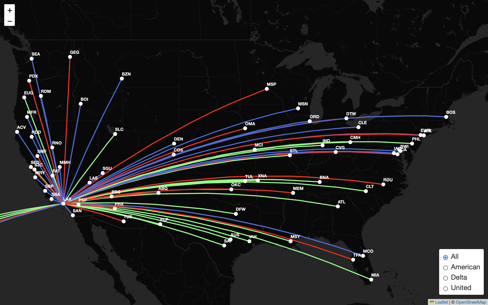
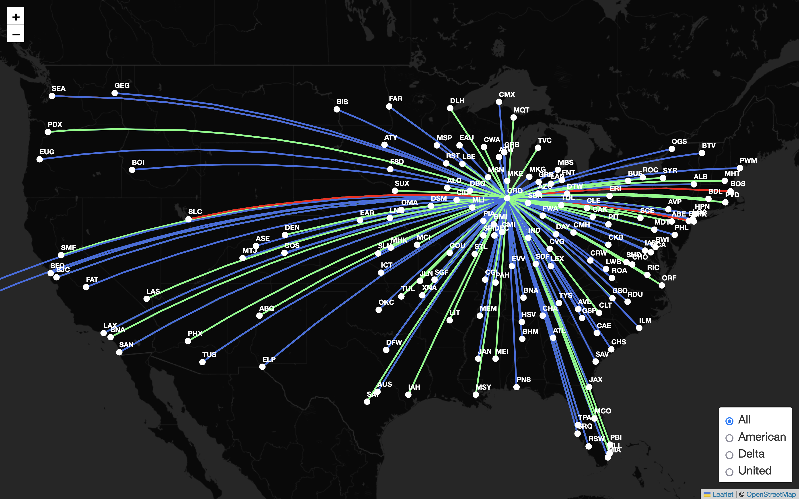
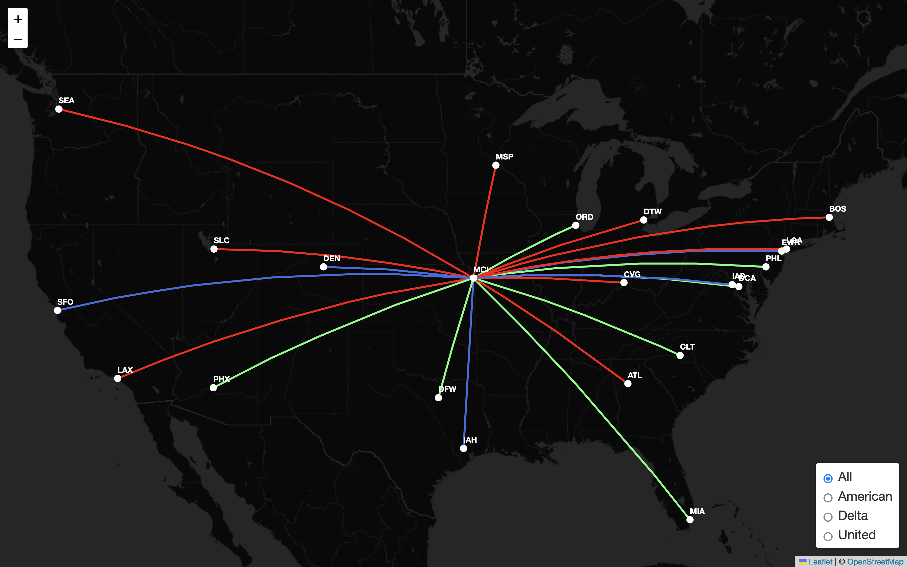
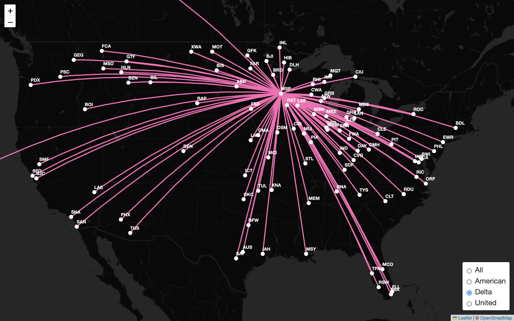

# Airline Maps

A tool for interactively visualizing airline maps, color-coded by either Airline or Hub. Try it out at [https://saumikn.com/airlinemaps](https://saumikn.com/airlinemaps).

Created by Saumik Narayanan.

## Description

Most official airline route maps are very difficult to understand and parse, because all of the lines on the map are the same color and it's nearly impossible to tell where the lines are coming from and going (e.g. [1](https://news.delta.com/sites/default/files/styles/twitter_share_1200/public/US_10_15-01_0.png?itok=kmb_mPtD), [2](https://images.airlineroutemaps.com/maps/United_Airlines.gif)).

This repository allows you to visualize the routes of a given airline more clearly, by color-coding the flight paths based on the base hub of the flight. For instance, in the image of Delta Airline's domestic routes, all the routes that start in Atlanta are shown in red, all Minneapolis routes are pink, all Seattle routes are dark blue, etc. Note that I've hidden routes which go between two hubs, and routes which don't connect with a hub are shown in gray.

I have also provided code which can display these maps interactively your browser, allowing you to filter routes dynamically based on airport. I've created default flight maps for American, Delta, and United Airlines, and it should be quite easy to edit the code to select your own map. I also created a flight mode which plots multiple airline routes on the same map, to visulize competing airline hubs.

Check the [Screenshots](#Screenshots) section for examples of this.

It should be noted that this code can be used not just for Domestic American/Delta/United routes, but to visualize international routes and other airlines as well. To do this, you'll have to change the filtering and coloring code accordingly.

## Data Source

The data for these maps comes from [Airline Route Mapper](http://arm.64hosts.com/), a free tool for mapping airline routes. This data is unfortunately a few months out of date, but I couldn't find anything better that was free.

I could have used the [BTS Airline Dataset](https://www.bts.gov/topics/airlines-airports-and-aviation), which has more up to date flights, as well as historical data going back decades. However, this dataset considers regional airlines such as [SkyWest](https://en.wikipedia.org/wiki/SkyWest_Airlines) seperately, so we would miss many routes. This is the problem that the related project by [kburchfiel](https://github.com/kburchfiel/route_maps_builder) faced, for instance.

I could have also used a dedicated flight API like [Cirrum](https://www.cirium.com/), [OAG](https://www.oag.com), [Flightaware](https://flightaware.com/) or others, but these all cost money :(.

## Running the Code

To run all the code, use the conda environment defined in [requirements.yml](https://github.com/saumikn/airlinemaps/blob/master/requirements.yml).

The initial data processing is located in [data/data_analysis.ipynb](https://github.com/saumikn/airlinemaps/blob/master/data/data_analysis.ipynb). Essentially, I merged the data in [routes.dat](https://github.com/saumikn/airlinemaps/blob/master/data/routes.dat) and [airport-codes.csv](https://github.com/saumikn/airlinemaps/blob/master/data/airport-codes.csv), and filtered based on a specified airline. I then created a new column for color, based on which hub the route flies out of or which airline operates the route. An example of this output can be found in [data/delta/routes.csv](https://github.com/saumikn/airlinemaps/blob/master/data/delta/routes.csv).

In my original attempt, I used Python to directly convert this code into an ipyleaflet widget. However, I switched to plain Javacript and Leaflet so I don't need to use a live Python server in order to run the interactive html maps. The old code is still there at to run at [python/ipyleaflet.ipynb](https://github.com/saumikn/airlinemaps/blob/master/python/ipyleaflet.ipynb) if you're interested in trying ipyleaflet.

Instead, I created a second file for futher data processing at [leaflet/leaflet.ipynb](https://github.com/saumikn/airlinemaps/blob/master/leaflet/leaflet.ipynb). This simply takes the preprocessed and filtered route data, and turns it into two GeoJSON files - one representing the locations of the airports and another for the routes. This is necessary so that Leaflet can easily load the data, since working with GeoJSONs is easier than working with CSVs. An example of this output can be found in [data/delta/airports.json](https://github.com/saumikn/airlinemaps/blob/master/data/delta/airports.json) and [data/delta/routes.json](https://github.com/saumikn/airlinemaps/blob/master/data/delta/routes.json).

The code to create the interactive Leaflet maps can be found in [leaflet/map.js](https://github.com/saumikn/airlinemaps/blob/master/leaflet/map.js). This code takes the earlier json data files, and adds them onto the map. I then add functions for hover and click events, which filter the map to only show routes connecting to tha airport that the user hovers over.

## Screenshots

Note that in all the images, route lines overlap. For example, both American and Delta fly nonstop between Atlanta and Dallas, but only one color can be shown since both lines take up the same space on the map. Also, I decided to remove JFK as one of American's hubs because adding a 10th color to the map would make things much more confusing, and JFK only connects to 31 other non-hub domestic cities, significantly fewer than any other hub for any airline.

&nbsp;

Domestic routes, color-coded by airline. American flights are in green, United flights are in blue, and Delta flights are in red.

&nbsp;

Domestic routes flown by American, color-coded by route hub. Flights from Chicago are in yellow, flights from Dallas are in orange, etc.

&nbsp;

Domestic routes flown by Delta, color-coded by route hub. Flights from Atlanta are in red, flights from Minneapolis are in pink, etc.

&nbsp;

Domestic routes flown by United, color-coded by route hub. Flights from Chicago are in red, flights from Dallas are in orange, etc.

&nbsp;

Domestic routes flown from LAX, using the same color scheme as the first screenshot. LAX is notable as the only airport which all three airlines use as a hub, so there are a significant number of lines in red, blue, and green.

&nbsp;

Domestic routes flown from ORD, using the same color scheme as the first screenshot. ORD another airport serving multiple airlines as a hub (American and United). This is why there are many blue and green lines, but very few red lines.

&nbsp;

Domestic routes flown from MCI, using the same color scheme as the first screenshot. MCI serves one of the biggest cities in the US, but isn't a hub for any airline.

&nbsp;

Domestic routes flown from MSP by Delta. Uses the same color scheme as the base Delta map.
